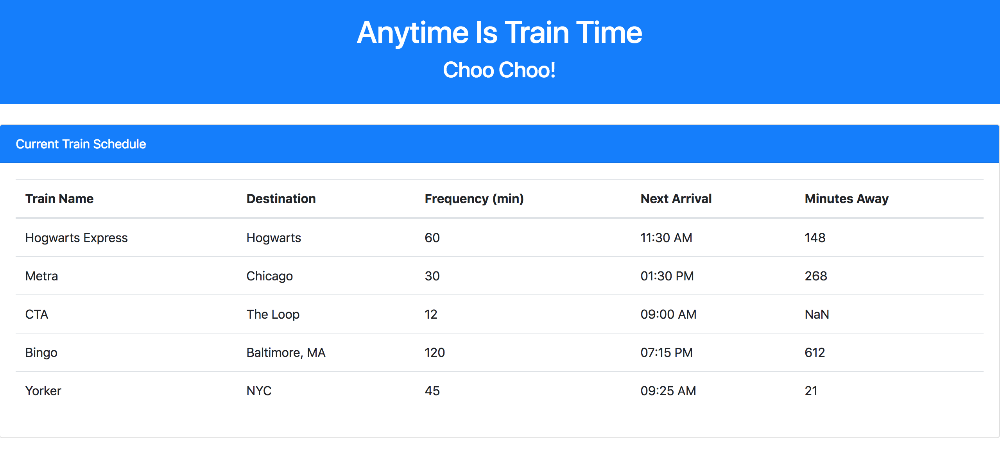
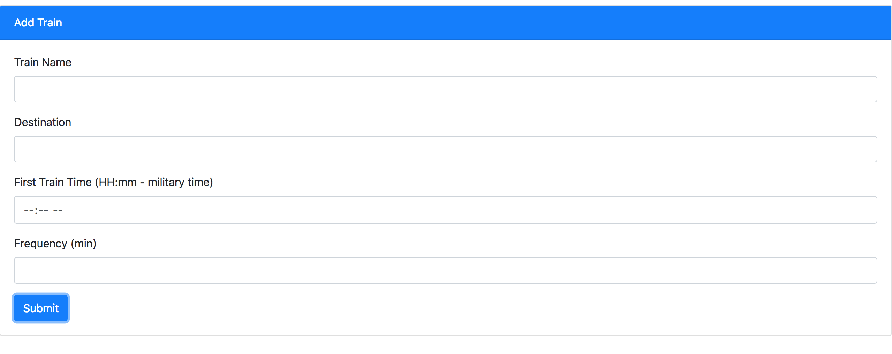

# Jay's Train Scheduler
Welcome to Jay's Train Scheduler, where anytime is train time!
https://jstep1.github.io/TrainScheduler/index.html

# Instructions
Use Jay's Train Scheduler to check our database of trains along with their destinations, next arrival time, frequency and how many minutes until your next train arrives. This information is updated on a daily basis. You can even add your own train and our algorithm will automatically calculate how long it will be until your ride arrives. Add to our page to help share the information with the public!

# About This App
This app was built with HTML, CSS and Javascript along with styling assistance from Bootstrap and database management by Firebase. Please see the source code for further information.

Enjoy!